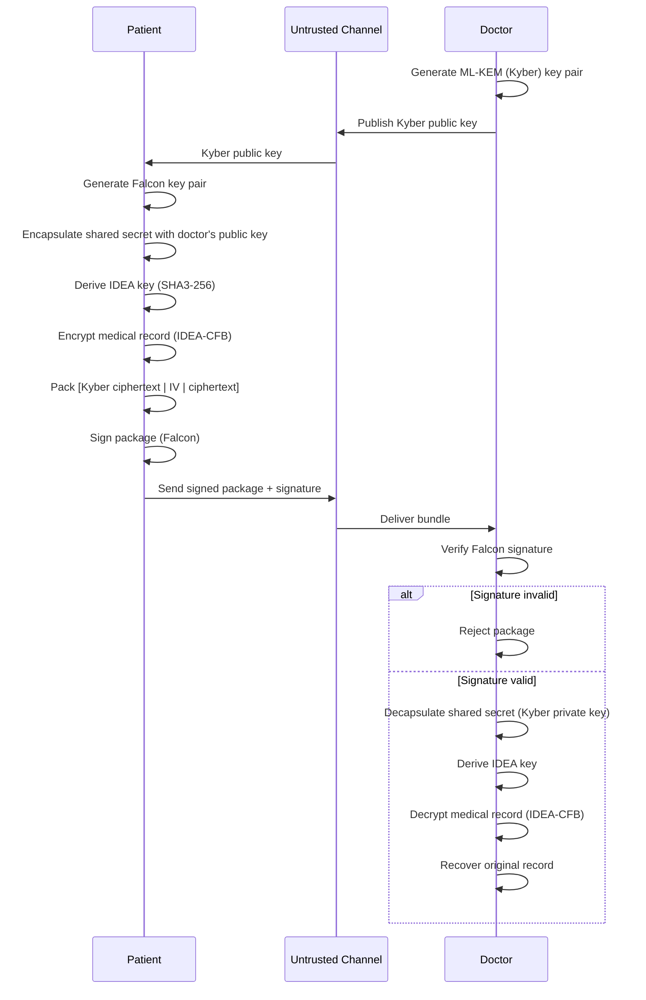

# Secure Medical Record Exchange

An educational, from-scratch implementation of a post-quantum-inspired secure
messaging pipeline, built to demonstrate how key encapsulation, symmetric
encryption, and digital signatures work together to protect sensitive data
in transit.

The project simulates a **patient sending a confidential medical record to a
doctor over an untrusted channel**, using three cryptographic primitives
implemented entirely in pure Python (no external crypto libraries):

| Primitive | Role | Style |
|---|---|---|
| **ML-KEM / CRYSTALS-Kyber** (Kyber-512 params) | Key encapsulation — delivers a shared secret using the doctor's public key | Lattice-based, post-quantum |
| **IDEA (CFB mode)** | Symmetric encryption of the medical record using a key derived from the shared secret | Block cipher, stream mode |
| **Falcon-style NTRU signature** | Signs the transmitted package so the doctor can verify authenticity and integrity | Lattice-based signature |

## How it works

1. **Doctor** generates an ML-KEM (Kyber) key pair. The public key is shared openly; the private key stays with the doctor.
2. **Patient** generates a Falcon key pair for signing. The public key is shared openly; the private key stays with the patient.
3. **Patient** encapsulates a fresh shared secret using the doctor's Kyber public key, producing a ciphertext that can travel over an open channel.
4. A **128-bit IDEA key** is derived from the shared secret via `SHA3-256("IDEA-KEY" || secret)[:16]`.
5. The **medical record is encrypted** with IDEA in CFB mode (no padding needed).
6. The Kyber ciphertext, IV, and encrypted record are packed into a single length-prefixed bundle and **signed with Falcon**.
7. **Doctor** receives the signed bundle, verifies the Falcon signature first, then decapsulates the shared secret with their private key and decrypts the record.
8. **Tampering tests** confirm that any modification to the package or ciphertext causes signature verification (or secret recovery) to fail.

### Flow diagram



### Screenshots

Sample run output from the notebook, showing the patient-side encryption flow
and the doctor-side verification/decryption flow:

**Patient flow — key generation, secret encapsulation, encryption, signing**


**Doctor flow — signature verification, decryption, tampering tests**


---

## Project structure

The project was originally built as a single Google Colab notebook
(`Secure_Medical_Record_Exchange.ipynb`), organized into self-contained cells:

```
Secure_Medical_Record_Exchange.ipynb
│
├── Cell 1 — Medical record input (in-memory synthetic record)
├── Cell 2 — Shared utility functions (hashing, bit/byte helpers)
├── Cell 3 — IDEA-CFB symmetric cipher (from scratch)
├── Cell 4 — Educational Kyber/ML-KEM key encapsulation (from scratch)
├── Cell 5 — Falcon-style NTRU signature scheme (from scratch)
├── Cell 6 — End-to-end exchange flow (patient + doctor pipeline)
└── Cell 7 — Run the full demo and print results
```

Each cryptographic module is self-contained and dependency-free — everything
is built on top of Python's standard library (`hashlib`, `os`).

## Running it

1. Open `Secure_Medical_Record_Exchange.ipynb` in Google Colab or Jupyter.
2. Run all cells in order (Cell 1 → Cell 7).
3. Cell 7 runs the complete simulation and prints:
   - Key generation details (sizes, in bytes)
   - Shared-secret encapsulation and derived IDEA key
   - Encrypted record details and fingerprint
   - Signed package size
   - Doctor-side signature verification, decryption, and recovered record
   - Tampering tests demonstrating rejection of modified data

No installation is required beyond a standard Python 3 environment —
there are no third-party dependencies.

## What the demo proves

- **Confidentiality** — the medical record is encrypted end-to-end with IDEA-CFB; only someone who recovers the shared secret can decrypt it.
- **Integrity** — any single-byte modification to the transmitted package causes Falcon signature verification to fail.
- **Authenticity** — the doctor only accepts data signed with the patient's Falcon private key, verified against the patient's public key.
- **Key delivery security** — only the doctor's Kyber private key can recover the shared secret encapsulated by the patient.

## Disclaimer

This repository is a learning exercise in applied cryptography and
post-quantum primitives. The Kyber, Falcon, and IDEA implementations here
are simplified for readability and are **not** validated, side-channel
resistant, or interoperable with standardized libraries. Do not use this
code to protect real medical or personal data.

## License

MIT — see [LICENSE](LICENSE) for details.
